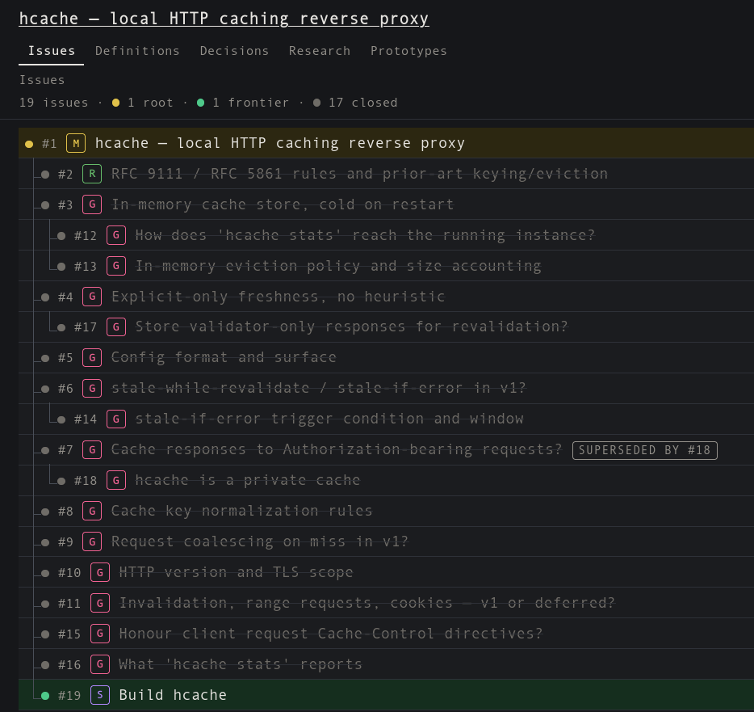

# wfr

**Plan → spec → implementation for agentic AI assisted work.**



Derived from [Matt Pocock's AI Skills for Real Engineers](https://github.com/mattpocock/skills).

It produces a browsable, single-file SQLite `.wf` database integrating the following:

1. Decision tree
2. Glossary
3. ADR
4. Prototypes
5. Research docs
6. Board

It consists of `SKILL.md` + additional reference md's (progressive disclosure) + a single `wfr.py` tool.

The `wfr.py` tool is designed primarily for agents to work with. However, you can use the tool to read the resulting `.wf` database and watch it as agents chip off the tickets one by one:

```sh
wfr.py serve big-feature.wf
```

This skill is still subject to improvement.

## Install

Only tested with Claude Code for now.

```
git clone https://github.com/rbsoen/wfr
cp -r wfr/skills/wfr ~/.claude/skills/wfr
```

## Invocation

1. Instantiate a new map: `/wfr I want a new feature...`
2. Answer grill rounds to sharpen the spec
3. Stop and pick up any time: `/wfr new-feature.wf`
4. Implement tickets `/wfr new-feature.wf implement 15-20`

**Stop a round at any time.** The skill makes the agent persist questions first into the database before asking it to you in chat—think of it as a kind of write-ahead log. Small contexts [tend to benefit agents](https://www.aihero.dev/ai-coding-dictionary/smart-zone), so use this to your advantage.

## Basic flow

```
map → grill
   |    `→ grill
   `→ research
   `→ prototype
   `→ task
   `→ spec
        `→ impl
```

1. The agent builds a **MAP**: it is a ledger stating the goal, what is decided on so far, what is still unknown, what is out of scope.
2. From the map, comes **GRILLS**: the heart of it all. It is a game of 50 questions to make you pin down the design. It essentially builds the _decision tree_ that forms the pathway to the goal.
3. Agents may need to do **RESEARCH** if there is some decision that needs an outside fact to confirm.
4. Agents may also sometimes need to do **TASKS** if some ticket required things to be moved around, written, or otherwise done first.
5. When you can't imagine what the agent is going for, or when it comes to UI, you can request the agent to create a **PROTOTYPE** for you to visually confirm and make a decision.
6. After everything is settled, you will have a **SPEC**.
7. The SPEC is then broken down to **IMPL** tickets, ready for the agent to execute.

Any one of these can be exported out at any time if the .md artifacts are needed, see `wfr.py export FILE DIR`.

## Why create this?

I've come to regularly use a couple of the skills from the set
this was based off of—`/grilling`, `/grill-with-docs`, `/wayfinder`. For most of my projects there is no issue tracker integration, so it created .md files instead, in accordance to their fallbacks.

While these docs are human-readable and meant to be committed in some way, I did not feel comfortable carrying them around.

I wanted to change the set so that it will do that but also be:

1. obvious to agents - hence the `wfr.py` tool
2. human readable - hence the server functionality in the same tool

## How do I know it's working?

1. You see a clear and comprehensive decision tree.
2. Decisions and recommendations are backed up by stored research docs.
3. Unambiguous glossary for project-specific terms that you and the agent share.
4. Build order: Red test → build → green test.
5. Checkpoints commented on implementation tickets to indicate progress—A compacted or interrupted session can anchor off it.
6. Implementation tickets get resolved with: what it does, what it verified, and what spec gaps it found and called.

## Applying the Ralph loop

Only after all of the implementation tickets have been created, you can  run the [Ralph loop](https://ghuntley.com/ralph/) on it, since one session completes one ticket.

The following shell invocation will perform 10 *sessions*, change the `{1..10}` if you want more. Sessions, because an implementation ticket may end up [being too big](skills/wfr/reference/deliverable.md) and the session will end up splitting it into sub-tickets—in this case, the next session may pick up one of the sub-tickets.

```sh
for i in {1..10}; do
  claude -p "/wfr <FILE.wf> Take the next Implementation ticket from the frontier and complete it. If a ticket is claimed, re-claim it; no other Implementation session is currently running." --permission-mode auto;
done
```

If you run a session in parallel (e.g. for bug fixing or a new requirement), ensure that instead of executing actions, tell the agent to file a ticket using this skill instead.